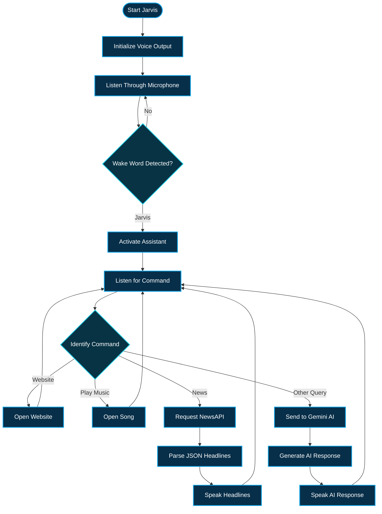

<h1 align="center">🤖 Jarvis AI Voice Assistant</h1>

<p align="center">
  <strong>Python Voice Assistant with Speech Recognition, Automation & Gemini AI</strong>
</p>

<p align="center">
  A practical Python project that listens to voice commands, performs everyday tasks,
  fetches live news, plays music, and uses Gemini AI for general questions.
</p>

<p align="center">
  
  
  
  
</p>

<p align="center">
  <a href="#-project-overview">Overview</a> •
  <a href="#-features">Features</a> •
  <a href="#-workflow">Workflow</a> •
  <a href="#-technology--concepts">Technology</a> •
  <a href="#-getting-started">Getting Started</a>
</p>

---

## 🔷 Project Overview

**Jarvis AI Voice Assistant** is a Python-based voice assistant developed as a practical student and portfolio project.

The assistant listens for the wake word **"Jarvis"** and then accepts spoken commands. It can open websites, play predefined music, fetch and read current news headlines, and use **Gemini AI** to respond to general questions.

Instead of practicing Python concepts separately, this project combines speech recognition, text-to-speech, APIs, browser automation, custom modules, environment variables, and generative AI into one working application.

### 📌 Project Snapshot

| Category | Details |
|---|---|
| 🎯 **Purpose** | AI-powered personal voice assistant |
| 🐍 **Language** | Python |
| 🎙️ **Input** | Microphone voice commands |
| 🔊 **Output** | Text-to-speech audio |
| 🤖 **AI** | Gemini AI |
| 📰 **Live Data** | NewsAPI |
| 🌐 **Automation** | Browser-based actions |
| 🔐 **Credentials** | Environment variables |

> [!NOTE]
> This project was built as a practical learning and portfolio project to strengthen Python fundamentals while gaining hands-on experience with APIs, automation, speech processing, and AI integration.

---

## ✅ Features

### 🎙️ Voice Recognition & Interaction

- Captures voice input through the microphone
- Converts speech into text using `SpeechRecognition`
- Uses **"Jarvis"** as the wake word
- Listens for commands after activation
- Handles recognition errors without terminating the application

### 🔊 Text-to-Speech

- Converts Jarvis responses into speech using `gTTS`
- Generates temporary MP3 audio
- Plays responses using `Pygame`
- Supports spoken responses from both built-in commands and Gemini AI

### 🌐 Web Automation

Jarvis can recognize voice commands and automatically open:

- Google
- YouTube
- Facebook

Web actions are performed using Python's built-in `webbrowser` module.

### 🎵 Music Playback

- Recognizes commands beginning with `play`
- Extracts the requested song name
- Uses a separate `MusicLibrary.py` module
- Maps song names to predefined URLs
- Opens the selected song in the browser

Example:

```text
Play sidhu
```

### 📰 Live News Updates

Jarvis integrates with **NewsAPI** to:

- Fetch current U.S. news headlines
- Send HTTP requests using `requests`
- Parse JSON API responses
- Extract article titles
- Read the headlines aloud

### 🤖 Gemini AI Integration

Commands that do not match predefined actions are sent to **Gemini AI**.

Jarvis can:

- Accept general questions
- Send the query to Gemini
- Generate short conversational responses
- Display the AI response in the terminal
- Speak the generated response aloud

### 🔐 Secure API Configuration

API credentials are kept outside the Python source code.

The project uses:

```python
from dotenv import load_dotenv
```

and:

```python
os.getenv()
```

to load private credentials from a local environment file.

The API-key file is excluded through `.gitignore` and is not uploaded to GitHub.

---

## 🔄 Workflow



---

## 🗣️ Example Commands

First activate Jarvis:

```text
Jarvis
```

Then use commands such as:

```text
Open Google
Open YouTube
Open Facebook
Play sidhu
Tell me the news
What is artificial intelligence?
Explain Python in simple words
```

### Example Interaction

```text
User: Jarvis

Jarvis: Yeah

User: Open YouTube

→ YouTube opens in the default browser
```

Another example:

```text
User: Jarvis

Jarvis: Yeah

User: What is artificial intelligence?

→ The query is sent to Gemini AI
→ Gemini generates a response
→ Jarvis speaks the response aloud
```

---

## 🧰 Technology & Concepts

### 🔹 Core Technologies

<p>
  
  
  
  
</p>

### 🐍 Python Libraries

| Library / Module | Purpose |
|---|---|
| `SpeechRecognition` | Convert microphone speech into text |
| `gTTS` | Convert text into speech |
| `Pygame` | Play generated audio |
| `Requests` | Send API requests |
| `google-genai` | Communicate with Gemini AI |
| `python-dotenv` | Load environment variables |
| `webbrowser` | Open websites and media links |
| `pyttsx3` | Offline text-to-speech experimentation |
| `os` | Read environment variables |
| `time` | Handle audio playback timing |

### 💡 Programming Concepts Practiced

- Functions
- Loops
- Conditional statements
- Nested control flow
- Exception handling
- Python modules and imports
- Dictionaries
- String processing
- HTTP requests
- JSON processing
- Environment variables
- API integration
- Speech input
- Audio output
- Browser automation

---

## 🧱 Project Structure

```text
Jarvis-AI-Voice-Assistant/
│
├── main.py
├── MusicLibrary.py
├── requirements.txt
├── README.md
├── LICENSE
└── .gitignore
```

### Local Files Not Uploaded to GitHub

```text
API_Keys.env
.venv/
__pycache__/
temp.mp3
client.py
```

### 📄 File Responsibilities

**`main.py`**  
Contains the main Jarvis logic including speech recognition, command processing, text-to-speech, NewsAPI integration, Gemini AI integration, and browser automation.

**`MusicLibrary.py`**  
Stores predefined song names and their corresponding URLs.

**`requirements.txt`**  
Contains the Python dependencies required to run the project.

**`.gitignore`**  
Prevents private, generated, and local development files from being committed.

**`LICENSE`**  
Contains the MIT License for the project.

> [!IMPORTANT]
> `API_Keys.env` remains local because it contains private API credentials. Never commit real API keys to a public GitHub repository.

---

## 🚀 Getting Started

### Prerequisites

Make sure you have:

- Python 3.10 or newer
- Working microphone
- Internet connection
- Gemini API key
- NewsAPI key

---

### 1️⃣ Clone the Repository

```bash
git clone https://github.com/huzaifa2612/Jarvis-AI-Voice-Assistant.git
```

Move into the project folder:

```bash
cd Jarvis-AI-Voice-Assistant
```

---

### 2️⃣ Create a Virtual Environment

```bash
python -m venv .venv
```

---

### 3️⃣ Activate the Virtual Environment

#### Windows

```bash
.venv\Scripts\activate
```

---

### 4️⃣ Install Dependencies

```bash
pip install -r requirements.txt
```

---

### 5️⃣ Configure API Keys

Create this file inside the project folder:

```text
API_Keys.env
```

Add your credentials:

```env
NEWS_API_KEY=your_newsapi_key_here
GEMINI_API_KEY=your_gemini_api_key_here
```

Do **not** commit this file to GitHub.

---

### 6️⃣ Run Jarvis

```bash
python main.py
```

Jarvis will initialize and start listening through the microphone.

Say:

```text
Jarvis
```

to activate the assistant.

---

## 🔐 Environment Variables

The environment file is loaded using:

```python
from dotenv import load_dotenv

load_dotenv("API_Keys.env")
```

Variables are then retrieved using:

```python
newsapi = os.getenv("NEWS_API_KEY")
```

The same approach is used for the Gemini API credential.

This keeps sensitive credentials separate from the public source code.

---

## 🎓 Learning Outcomes

Building this project helped me understand how different Python concepts can work together inside one complete application.

### Python Development

- Built reusable Python functions
- Worked with loops and conditional logic
- Imported and used external libraries
- Created and imported a custom Python module
- Implemented exception handling
- Processed strings and dictionaries

### API & Integration Skills

- Sent HTTP requests
- Worked with JSON responses
- Integrated NewsAPI
- Integrated Gemini AI
- Used environment variables for credentials

### Voice & Automation

- Captured microphone input
- Converted speech to text
- Converted text to speech
- Generated and played audio
- Automated browser actions
- Built wake-word-based command processing

### Development Workflow

- Used a Python virtual environment
- Managed dependencies with `requirements.txt`
- Protected secrets with `.gitignore`
- Used Git for version control
- Published and documented the project on GitHub

---

## 🎯 Project Goal

The goal of this project was not simply to create a voice assistant.

The main objective was to strengthen my Python fundamentals by combining multiple concepts and services into one practical application.

Through Jarvis, I gained hands-on experience connecting:

```text
Voice Input
    ↓
Python Logic
    ↓
Automation / APIs / Gemini AI
    ↓
Voice Output
```

This project helped me understand how Python applications can interact with users, external services, and real-time information.

---

## 🤝 Feedback

### Suggestions and improvements are welcome

Jarvis AI Voice Assistant was developed as a student learning and portfolio project.

Constructive feedback that can help me improve my Python development, problem-solving, and software-engineering skills is welcome.

<p>
  <a href="https://github.com/huzaifa2612/Jarvis-AI-Voice-Assistant">
    
  </a>
</p>

---

## 📄 License

This project is licensed under the **MIT License**.

---

<p align="center">
  <strong>🤖 Jarvis AI Voice Assistant</strong>
</p>

<p align="center">
  Built as a practical Python student portfolio project
</p>

<p align="center">
  
  
  
</p>