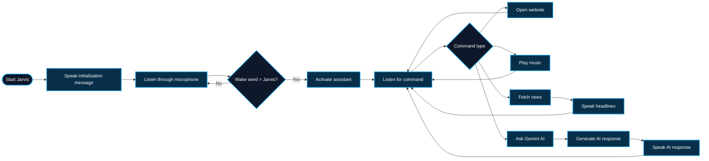

<div align="center">

# 🤖 Jarvis Voice Assistant

### Python-Based Voice Assistant with Speech Recognition, Automation & Gemini AI

<p>
  A student-built Python voice assistant that listens to spoken commands,<br>
  performs everyday tasks, fetches live news, plays music, and uses Gemini AI for general questions.
</p>

<p>
  
  
  
  
</p>

<p>
  <a href="#-project-overview">Overview</a>
  &nbsp;•&nbsp;
  <a href="#-features">Features</a>
  &nbsp;•&nbsp;
  <a href="#-how-it-works">Workflow</a>
  &nbsp;•&nbsp;
  <a href="#-technology--concepts">Technology</a>
  &nbsp;•&nbsp;
  <a href="#-getting-started">Getting Started</a>
</p>

</div>

---

## 🔷 Project Overview

<table>
  <tr>
    <td width="58%" valign="top">
      <h3>A practical Python voice-assistant project</h3>
      <p>
        <strong>Jarvis</strong> is a Python-based voice assistant developed as a practical
        student project to explore speech recognition, text-to-speech, APIs, automation,
        external modules, and AI integration.
      </p>
      <p>
        The assistant listens for the wake word <strong>"Jarvis"</strong> and then accepts
        spoken commands. It can open websites, play predefined music, read current news
        headlines, and send general queries to Gemini AI.
      </p>
      <p>
        The project combines multiple Python concepts and external services into one
        working application instead of demonstrating them separately.
      </p>
    </td>

    <td width="42%" valign="top">
      <h3>Project Snapshot</h3>
      <p><strong>🎯 Purpose</strong><br>Personal voice assistant</p>
      <p><strong>🐍 Language</strong><br>Python</p>
      <p><strong>🎙️ Input</strong><br>Voice commands</p>
      <p><strong>🔊 Output</strong><br>Text-to-speech</p>
      <p><strong>🤖 AI</strong><br>Gemini integration</p>
      <p><strong>📰 Data</strong><br>News API</p>
    </td>
  </tr>
</table>

> [!NOTE]
> Jarvis was developed as a learning and portfolio project to gain hands-on experience with Python automation, APIs, speech processing, and AI-powered applications.

---

## ✅ Features

<table>
  <tr>
    <td width="50%" valign="top">
      <h3>🎙️ Voice Interaction</h3>
      <ul>
        <li>Listen to microphone input</li>
        <li>Recognize spoken commands</li>
        <li>Use <strong>Jarvis</strong> as the wake word</li>
        <li>Convert assistant responses into speech</li>
        <li>Play generated speech using Pygame</li>
      </ul>
    </td>

    <td width="50%" valign="top">
      <h3>🌐 Web Automation</h3>
      <ul>
        <li>Open Google through a voice command</li>
        <li>Open YouTube</li>
        <li>Open Facebook</li>
        <li>Launch webpages using Python's web browser module</li>
      </ul>
    </td>
  </tr>

  <tr>
    <td width="50%" valign="top">
      <h3>🎵 Music Playback</h3>
      <ul>
        <li>Recognize commands beginning with <code>play</code></li>
        <li>Use a local Python music library</li>
        <li>Open predefined songs from stored links</li>
      </ul>
    </td>

    <td width="50%" valign="top">
      <h3>📰 News Updates</h3>
      <ul>
        <li>Fetch current U.S. news headlines using NewsAPI</li>
        <li>Parse API responses in JSON format</li>
        <li>Read news headlines aloud</li>
      </ul>
    </td>
  </tr>

  <tr>
    <td width="50%" valign="top">
      <h3>🤖 Gemini AI Integration</h3>
      <ul>
        <li>Send general user queries to Gemini AI</li>
        <li>Use a custom Jarvis system instruction</li>
        <li>Return short conversational responses</li>
        <li>Speak AI-generated responses aloud</li>
      </ul>
    </td>

    <td width="50%" valign="top">
      <h3>🔐 Secure API Configuration</h3>
      <ul>
        <li>Store API credentials outside the source code</li>
        <li>Load environment variables using <code>python-dotenv</code></li>
        <li>Exclude API-key files through <code>.gitignore</code></li>
      </ul>
    </td>
  </tr>
</table>

<div align="center">


</div>

---

## 🔄 How It Works



---

## 🗣️ Example Commands

```text
Jarvis
```

Then try commands such as:

```text
Open Google
Open YouTube
Open Facebook
Play sidhu
Tell me the news
What is artificial intelligence?
Explain Python in simple words
```

Commands that do not match the built-in actions are passed to Gemini AI.

---

## 🧰 Technology & Concepts

<div align="center">

### Core Technology


</div>

<br>

<table>
  <tr>
    <td width="50%" valign="top">
      <h3>🐍 Python Libraries</h3>
      <ul>
        <li><code>SpeechRecognition</code></li>
        <li><code>gTTS</code></li>
        <li><code>Pygame</code></li>
        <li><code>Requests</code></li>
        <li><code>python-dotenv</code></li>
        <li><code>webbrowser</code></li>
        <li><code>pyttsx3</code></li>
        <li>Google GenAI SDK</li>
      </ul>
    </td>

    <td width="50%" valign="top">
      <h3>⚙️ Concepts Practiced</h3>
      <ul>
        <li>Functions</li>
        <li>Conditional statements</li>
        <li>Loops</li>
        <li>Exception handling</li>
        <li>Modules and imports</li>
        <li>Dictionary-based data storage</li>
        <li>API requests and JSON processing</li>
        <li>Environment variables</li>
        <li>Speech input and audio output</li>
      </ul>
    </td>
  </tr>
</table>

---

## 🧱 Project Structure

```text
Mega-Project-1-Jarvis/
│
├── main.py
├── MusicLibrary.py
├── requirements.txt
├── README.md
├── LICENSE
├── .gitignore
│
├── API_Keys.env        # Local only — ignored by Git
├── .venv/              # Local virtual environment
├── __pycache__/        # Generated Python cache
└── temp.mp3            # Generated speech audio
```

> [!IMPORTANT]
> `API_Keys.env` is intentionally excluded from GitHub because it contains private API credentials.

---

## 🚀 Getting Started

### Prerequisites

- Python 3.10 or newer
- Working microphone
- Internet connection
- Gemini API key
- NewsAPI key

### 1. Clone the Repository

```bash
git clone https://github.com/YOUR-USERNAME/Mega-Project-1-Jarvis.git
```

```bash
cd Mega-Project-1-Jarvis
```

### 2. Create a Virtual Environment

```bash
python -m venv .venv
```

### 3. Activate the Virtual Environment

**Windows**

```bash
.venv\Scripts\activate
```

### 4. Install Dependencies

```bash
pip install -r requirements.txt
```

### 5. Configure API Keys

Create a local file named:

```text
API_Keys.env
```

Add:

```env
NEWS_API_KEY=your_newsapi_key_here
GEMINI_API_KEY=your_gemini_api_key_here
```

Do not commit this file to GitHub.

### 6. Run Jarvis

```bash
python main.py
```

Jarvis will initialize and begin listening for the wake word:

```text
Jarvis
```

---

## 🔐 Environment Variables

The project keeps API credentials separate from source code.

```python
newsapi = os.getenv("NEWS_API_KEY")
gemini_api = os.getenv("GEMINI_API_KEY")
```

This makes the repository safer to share publicly and demonstrates a more professional approach to handling credentials.

---

## 🎓 What I Learned

Building Jarvis helped me practice how different Python concepts can work together inside one complete project.

Through this project, I worked with:

- Speech recognition and microphone input
- Text-to-speech conversion
- External APIs
- JSON responses
- Gemini AI integration
- Browser automation
- Python modules
- Exception handling
- Environment variables
- Git and GitHub
- Dependency management
- Building a real menu-less, event-driven application

The main goal was not only to build a voice assistant, but also to understand how Python can connect different services and libraries to solve practical tasks.

---

## 🤝 Feedback

<table>
  <tr>
    <td width="70%" valign="top">
      <h3>Suggestions and improvements are welcome</h3>
      <p>
        Jarvis was developed as a student learning and portfolio project.
        Feedback that can help improve my Python development and software-engineering skills is welcome.
      </p>
    </td>

    <td width="30%" align="center" valign="middle">
      
    </td>
  </tr>
</table>

---

## 📄 License

This project is licensed under the **MIT License**.

<div align="center">

<br>

**Jarvis Voice Assistant** · Built as a practical Python student project

<br><br>


</div>